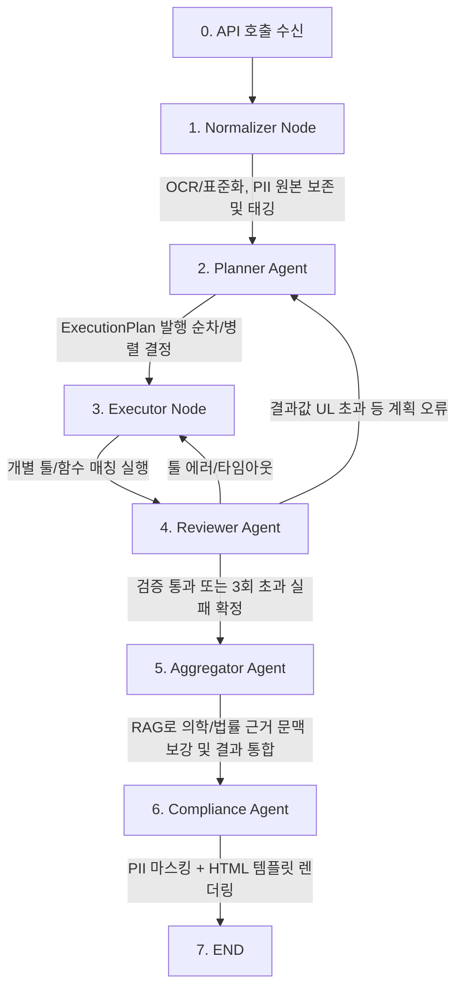

# 🛠️ AI 영양제 추천 서비스 실서비스 연동 구현 계획 (v2)

현재 하드코딩된 에이전트 파이프라인을 **실제 작동하는 OpenAI 모델(openai/gpt-4.1-mini)**, **Neon PostgreSQL**, **로컬 MCP 툴(`localhost:8080`)** 및 **오케스트레이션/셀프-커렉션 모델**에 정확히 일치하도록 고도화한다.

> v2 변경 사항
> 1. RAG를 Planner 이전이 아닌 **Aggregator 단계**로 이동 (계획 수립용이 아니라 결과 요약 시 근거 보강용)
> 2. `ExecutionPlan` 스키마 확정 및 병렬 실행 필드 추가
> 3. Reviewer의 `reject_to_planner` / `reject_to_executor` 판단 기준 명확화
> 4. 최대 3회 재시도 후 모두 실패 시 **부분 실패로 종료**하는 fallback 로직 추가
> 5. PII는 삭제하지 않고 **원본 그대로 저장**, **사용자 노출 시점(Compliance Agent)에만 마스킹**

---

## 1. 아키텍처 개요 및 노드별 역할



### 1) Normalizer Node (입력 & OCR)
- `services/ocr.py`, `nodes/normalizer.py`가 동기화되어 작동한다.
- `openai/gpt-4.1-mini` Vision 기능 또는 로컬 MCP `normalize_medical_data` 툴을 활용해 건강 검진표 수치를 구조화된 JSON으로 파싱한다.
- **PII는 제거하지 않는다.** 이름, 생년월일 등 민감 정보는 원본 그대로 구조화 데이터에 포함하되, 어떤 필드가 PII인지 스키마 레벨에서 태깅(`is_pii: true`)해 이후 단계(특히 Compliance Agent의 마스킹 로직)가 식별할 수 있게 한다.

### 2) Planner Agent (오케스트레이터)
- 작업을 직접 처리하지 않고, State(정규화된 검진 데이터 + 사용자 기본 정보)를 읽어 실행할 작업 목록과 순차/병렬 여부가 담긴 `ExecutionPlan`을 동적으로 생성한다.
- KDRI 권장/상한 기준 등 도메인 지식은 별도 RAG 검색 없이 MCP 툴(`calculate_dynamic_ri` 등) 내부 로직/테이블에 이미 반영되어 있다고 가정한다.

#### ExecutionPlan 스키마

```python
from typing import Any, Literal
from pydantic import BaseModel, Field

ToolName = Literal[
    "calculate_dynamic_ri",
    "validate_ul_guardrail",
    "check_nutrient_interactions",
    "search_products",
]

class PlanStep(BaseModel):
    step: int
    task_name: str
    tool_name: ToolName
    args: dict[str, Any] = Field(default_factory=dict)
    description: str
    parallel_group: int | None = None
    # 같은 parallel_group 값을 가진 step들은 asyncio.gather로 동시 실행.
    # None인 step은 자신의 step 순서에 따라 단독으로 순차 실행.

class ExecutionPlan(BaseModel):
    steps: list[PlanStep]
```

- `tool_name`을 `Literal`로 제한해, gpt-4.1-mini의 structured output 단계에서 존재하지 않는 툴을 계획에 포함시키는 것을 스키마 레벨에서 방지한다.
- `parallel_group`을 기준으로 Executor가 실행 그룹을 나눈다. 예: `parallel_group=1`인 step 2개는 `asyncio.gather`로, `parallel_group=None`인 step은 `step` 오름차순으로 순차 실행.

### 3) Executor Node (실행기)
- Planner가 수립한 `ExecutionPlan`의 지시에만 복종한다.
- 각 step의 `tool_name`에 매칭되는 로컬 MCP 툴을 `args`와 함께 호출한다.
- `parallel_group`이 있는 step들은 `asyncio.gather(..., return_exceptions=True)`로 묶어 실행하여, 그룹 내 일부 호출이 실패해도 나머지 결과는 정상 수집한다.
- 각 step 실행 결과는 `{step, tool_name, status: "success"|"error", result | error_message}` 형태로 Reviewer에 전달한다.

### 4) Reviewer Agent (가드레일 & 셀프 커렉션 루프)
- Executor가 제출한 결과를 검수하며, 판단 기준은 별도의 md 파일을 루트에 생성하여 다음 두 가지로 고정하고, 참고할 수 있도록 한다.

| 상황 | 원인 판단 | 라우팅 |
|---|---|---|
| MCP 툴 호출 자체가 에러/타임아웃 | 실행(Executor) 문제 | `reject_to_executor` |
| 툴은 정상 응답했으나 결과값이 UL 상한 초과 등 가드레일 위반 | 계획(Planner) 단계에서 잘못된 툴/파라미터 선택 가능성 | `reject_to_planner` |

- 위 두 라우팅 모두 **최대 3회**까지 파이프라인을 재수행한다(재시도 횟수는 State에 `retry_count`로 누적 관리).
- **3회를 모두 소진하고도 실패한 항목이 있는 경우**, 해당 항목은 재시도를 중단하고 **부분 실패(partial_failure)**로 확정하여 다음 단계(Aggregator)로 넘긴다. 전체 파이프라인을 중단시키지 않는다.
  - 실패 항목의 상태는 `{step, tool_name, status: "failed", reason}`으로 State에 기록되고, 성공한 다른 항목들은 정상 결과로 함께 전달된다.
  - Compliance Agent 최종 응답에는 다음과 같은 형태의 안내 문구가 포함된다(예시):
    > "일부 항목(예: OO 성분 상한 섭취량 검증)은 자동 검증을 완료하지 못해 이번 결과에서 제외되었습니다. 해당 항목은 전문가와 상담하시기를 권장드립니다."
  - 실패 원인(reason)은 사용자에게 기술적 세부사항 대신 요약된 안내 문구로만 노출한다.

### 5) Aggregator Agent (결과 통합 및 지식 융합)
- 검증을 통과한 결과값(및 3)번의 부분 실패 항목 정보)을 취합한다.
- 이 단계에서 **RAG를 수행**하여, 확정된 결과에 대한 의학적/법률적 자문 문맥 및 추가 영양 상세 정보를 검색해 보강한다.
  - Planner 단계가 아닌 여기서 RAG를 수행하는 이유: 계획 수립 시점에는 아직 무엇을 근거로 뒷받침해야 할지 알 수 없고, 결과가 확정된 뒤 "이 결과를 어떻게 설명/보강할 것인가"를 위한 검색이 목적에 더 부합하기 때문.

### 6) Compliance Agent (PII 마스킹 + HTML 렌더링)
- 취합된 정보를 미리 정의된 HTML 템플릿에 대입해 최종 렌더링한다.
- **이 단계에서만 PII 마스킹을 수행한다.** Normalizer 단계에서 태깅해둔 `is_pii` 필드를 기준으로, 사용자에게 노출되는 최종 응답에서만 이름·생년월일 등을 마스킹 처리(예: `홍*동`, `19**-**-**`)한다. DB에 저장된 원본 데이터는 그대로 유지된다.
- 의료법상 처방/진단을 대신할 수 없다는 면책조항(Disclaimer)을 HTML 내 정형 문구로 포함한다.
- 완성된 HTML 스트링을 최종 API 응답으로 반환한다.

---

## 2. 연동 인프라 사양 및 설정

- **모델 사양**: `openai/gpt-4.1-mini` (`agent/.env`의 `OPENAI_BASE_URL` 및 API 키 활용)
- **데이터베이스**: Neon PostgreSQL (`DATABASE_URL` 연결 정보 활용)
  - PII를 포함한 원본 검진 데이터를 그대로 저장하므로, 저장 테이블에 대한 **암호화(at-rest) 및 접근 제어(권한 분리)**를 별도로 검토할 것을 권장한다. (이번 계획서 범위 밖이지만 후속 작업으로 남겨둠)
- **로컬 MCP 툴 연동**: `http://localhost:8080`에 JSON-RPC 호출을 수행해 각 노드의 비즈니스 연산을 처리한다.

---

## 3. 남은 미결 사항 (후속 검토 필요)

- MCP 툴 자체의 타임아웃/재시도 정책(예: 몇 초 대기 후 몇 회 재시도할지)은 아직 명시되지 않음.
- Neon DB의 PII 원본 저장에 따른 암호화/접근 제어 정책은 별도 설계 필요.
- 부분 실패(`partial_failure`) 상태가 반복적으로 발생하는 특정 툴/파라미터 조합에 대한 모니터링·알림 체계는 이번 계획서에 포함되지 않음.