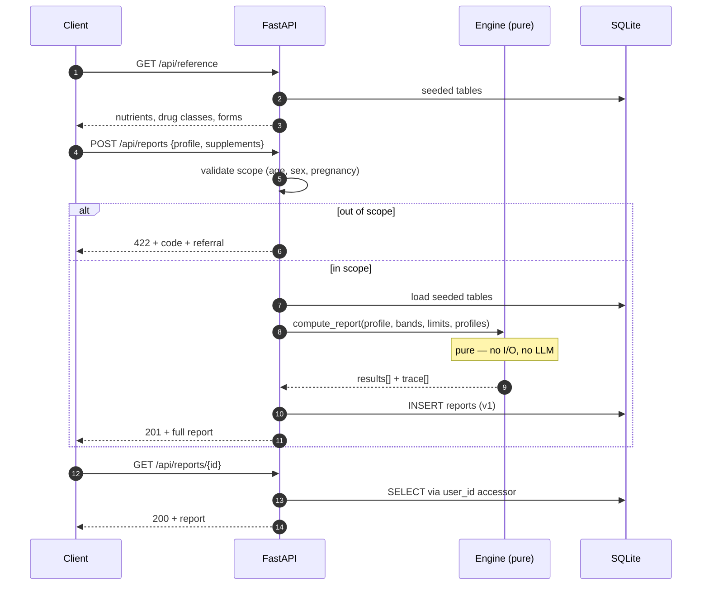

# API 명세 — 영양제 추천 엔진

**Related:** [erd.md](erd.md) · [권한정책.md](권한정책.md) · [기능명세서.md](기능명세서.md) · [qa.md](qa.md)

Base path `/api`. JSON in, JSON out, UTF-8. All user-facing strings Korean.

**Phase 2 endpoints (§3) are specified in full** — they are what gets built next. **Phases 3-7 (§6) are an endpoint inventory**, deliberately shallow: their shapes depend on engine and LLM signatures that do not exist yet, and specifying them precisely now would produce fiction that has to be rewritten.

---

## 1. Conventions

| | |
|---|---|
| Auth | Session cookie (`sid`), HTTP-only, `Secure`, `SameSite=Lax`. Anonymous sessions permitted |
| Content type | `application/json`, except `POST /api/intake/ocr` (`multipart/form-data`) |
| Units | Numbers are floats in the nutrient's own unit. Units are returned, never parsed from input |
| Time | ISO 8601 UTC |
| Idempotency | `POST /api/reports` accepts `Idempotency-Key`; a repeat returns the original report |

### Error envelope

Refusals are a **first-class output**, not an exception. Every one carries a machine-readable `code` and a Korean `message` the client can render directly.

```json
{
  "error": {
    "code": "AGE_OUT_OF_SCOPE",
    "message": "만 19세 이상 성인만 이용할 수 있습니다.",
    "detail": "소아·청소년 섭취기준은 연령 구간이 달라 별도 검토가 필요합니다.",
    "referral": "소아청소년과 또는 영양사 상담을 권해 드립니다.",
    "field": "age"
  }
}
```

| Code | HTTP | Meaning |
|---|---|---|
| `SEX_REQUIRED` | 422 | Sex omitted. No `gender=ALL` band exists for adults, so it cannot be defaulted |
| `AGE_OUT_OF_SCOPE` | 422 | Under 19 |
| `PREGNANCY_OUT_OF_SCOPE` | 422 | Pregnancy or lactation declared |
| `INVALID_INTAKE` | 422 | Malformed supplement row |
| `UNRESOLVED_INTAKE` | 422 | Client submitted an item still flagged 확인 필요 |
| `REPORT_NOT_FOUND` | 404 | Missing, or owned by someone else — see below |
| `FORBIDDEN` | 403 | Authenticated but not the owner |
| `RATE_LIMITED` | 429 | Includes `Retry-After` |
| `INTERNAL` | 500 | Never contains report contents |

> Reads of a report the caller does not own return **404, not 403** — a 403 confirms the report exists. See [권한정책.md TB-3](권한정책.md#tb-3--user_id-accessor-data-isolation).

---

## 2. Request flow



---

## 3. Phase 2 endpoints

### 3.1 `GET /api/reference`

Static reference data for the intake wizard. Cacheable, no auth.

**200**

```json
{
  "kdri_version": "2025",
  "nutrients": [
    {
      "nutrient_code": "magnesium",
      "nutrient_ko": "마그네슘",
      "group_name": "mineral",
      "target_unit": "mg",
      "ul_unit": "mg",
      "synonyms": ["Mg", "산화마그네슘", "구연산마그네슘"],
      "forms": [
        { "name_ko": "산화마그네슘", "elemental_pct": 0.603 },
        { "name_ko": "구연산마그네슘", "elemental_pct": 0.161 },
        { "name_ko": "마그네슘 비스글리시네이트", "elemental_pct": 0.141 }
      ]
    }
  ],
  "drug_classes": [
    { "code": "levothyroxine", "label_ko": "레보티록신(씬지로이드)" },
    { "code": "quinolone", "label_ko": "퀴놀론계 항생제" },
    { "code": "warfarin", "label_ko": "와파린" }
  ],
  "energy_ratios": [
    { "macronutrient": "carbohydrate", "pct_min": 50, "pct_max": 65 },
    { "macronutrient": "protein", "pct_min": 10, "pct_max": 20 },
    { "macronutrient": "fat", "pct_min": 15, "pct_max": 30 }
  ]
}
```

Returns 30 nutrients. `forms` is present only where a form changes elemental content or unit.

---

### 3.2 `POST /api/reports`

Compute and persist a report. **The only path into the engine.** Accepts structured intake only — there is no free-text field, by design ([TB-2](권한정책.md#tb-2--confirm-screen-human-checkpoint)).

**Request**

```json
{
  "profile": {
    "age": 34,
    "sex": "M",
    "weight_kg": 72,
    "is_pregnant": false,
    "is_lactating": false,
    "goals": ["sleep"]
  },
  "supplements": [
    {
      "nutrient_code": "magnesium",
      "form_ko": "산화마그네슘",
      "dose": 600,
      "unit": "mg",
      "doses_per_day": 1
    }
  ],
  "medications": ["quinolone"],
  "biomarkers": [
    { "code": "hemoglobin", "value": 11.2, "unit": "g/dL" }
  ],
  "parent_id": null
}
```

| Field | Required | Notes |
|---|---|---|
| `profile.age` | **yes** | integer ≥ 19 |
| `profile.sex` | **yes** | `"M"` or `"F"`. Cannot be defaulted |
| `profile.weight_kg` | no | Stored, **affects nothing** — `is_weight_scaled` is false on all 1052 KDRI rows |
| `supplements[].form_ko` | no | Absent ⇒ dose treated as elemental, factors default to 1.0 |
| `parent_id` | no | Set on 입력 수정; creates version *n+1* |

**201**

```json
{
  "report_id": 41,
  "version": 1,
  "parent_id": null,
  "created_at": "2026-08-10T04:12:33Z",
  "kdri_version": "2025",
  "disclaimer": "본 결과는 진단·치료 목적이 아니며, 2025 한국인 영양소 섭취기준에 근거한 참고 정보입니다.",
  "summary": { "over": 1, "deficit": 12, "adequate": 9, "unknown": 8 },
  "results": [
    {
      "nutrient_code": "magnesium",
      "nutrient_ko": "마그네슘",
      "status": "OVER",
      "target": 380.0,
      "target_unit": "mg",
      "from_diet": 266.0,
      "from_supplements": 361.8,
      "gap": 0.0,
      "headroom": -11.8,
      "recommend": 0.0,
      "limit": {
        "value": 350.0,
        "unit": "mg",
        "basis": "supplemental_only",
        "source": "KDRI 2025 마그네슘 상한섭취량 — 식품 외 급원에만 적용"
      },
      "message_ko": "현재 보충제 섭취량이 상한섭취량을 11.8mg 초과합니다. 용량을 줄이세요.",
      "interactions": [
        {
          "drug_class": "quinolone",
          "severity": "high",
          "action": "2시간 이상 간격 두기",
          "source": "약물-영양소 상호작용 가이드"
        }
      ],
      "trace": [
        {
          "rule_id": "target.from_band",
          "inputs": { "sex": "M", "age": 34, "band": [30, 49] },
          "output": 380.0,
          "citation": "KDRI 2025"
        },
        {
          "rule_id": "intake.accumulated",
          "inputs": { "items": 1 },
          "output": { "toward_target": 361.8, "toward_limit": 361.8 }
        },
        {
          "rule_id": "diet.baseline",
          "inputs": { "target": 380.0, "pct": 0.7 },
          "output": 266.0,
          "citation": "KNHANES"
        },
        {
          "rule_id": "recommend.computed",
          "inputs": { "gap": 0.0, "headroom": -11.8, "basis": "supplemental_only" },
          "output": 0.0,
          "citation": "KDRI 2025 마그네슘 상한섭취량"
        }
      ]
    }
  ],
  "energy_ratios_reference": [
    { "macronutrient": "carbohydrate", "pct_min": 50, "pct_max": 65, "note_ko": "참고용 — 실제 섭취 열량 정보가 없어 평가하지 않습니다" }
  ]
}
```

**`results` always contains all 30 nutrients**, ordered `OVER` → biomarker-flagged → `DEFICIT` by gap ratio → `ADEQUATE` → `UNKNOWN`.

`headroom` may be negative — that *is* the `OVER` magnitude. `recommend` is never negative.

`limit` is `null` for the 12 nutrients with no established upper limit. Absence of a ceiling still caps `recommend` at `gap`.

**422 — out of scope**

```json
{
  "error": {
    "code": "PREGNANCY_OUT_OF_SCOPE",
    "message": "임신·수유 중에는 결과를 제공하지 않습니다.",
    "detail": "임신부 기준은 별도 가산값이며 수유부 기준은 현재 데이터에 포함되어 있지 않습니다.",
    "referral": "산부인과 상담을 권해 드립니다.",
    "field": "profile.is_pregnant"
  }
}
```

---

### 3.3 `GET /api/reports/{id}`

**200** — identical body to `POST`. **404** if missing *or* not owned.

---

### 3.4 `DELETE /api/reports/{id}`

**204.** Cascades to `chat_messages`. Descendant versions have `parent_id` set to null rather than being deleted, so a chain survives an ancestor's removal.

---

### 3.5 `GET /api/health`

**200** `{ "status": "ok", "kdri_version": "2025", "band_rows": 300, "seed_assertions": "passed" }`

`band_rows` must be exactly 300. A different number means the seed filter drifted and the deploy is bad.

---

## 4. Validation rules

| Rule | Failure |
|---|---|
| `age` integer, ≥ 19 | `AGE_OUT_OF_SCOPE` |
| `sex` ∈ `{M, F}`, present | `SEX_REQUIRED` |
| `is_pregnant` or `is_lactating` true | `PREGNANCY_OUT_OF_SCOPE` |
| `supplements[].nutrient_code` in the 30 in-scope codes | `INVALID_INTAKE` |
| `supplements[].dose` > 0, finite | `INVALID_INTAKE` |
| `supplements[].doses_per_day` in `(0, 24]` | `INVALID_INTAKE` |
| `form_ko`, when present, exists for that nutrient | `INVALID_INTAKE` |
| No item carries `unresolved: true` | `UNRESOLVED_INTAKE` |
| `medications[]` are known drug class codes | ignored with a warning, never rejected |
| `parent_id`, when present, is owned by the caller | `REPORT_NOT_FOUND` |

An unknown drug class does not fail the request — it produces 평가되지 않음 on the affected nutrients. Refusing the whole report because one medication is unrecognized would be worse than saying so.

---

## 5. Rate limits

| Endpoint | Limit |
|---|---|
| `POST /api/reports` | 30 / hour / session |
| `POST /api/intake/ocr` | 20 / hour / session |
| `POST /api/reports/{id}/chat` | 60 / hour / session |
| `POST /api/auth/magic-link` | 5 / hour / email · 20 / hour / IP |

---

## 6. Endpoint inventory — Phases 3-7

Shapes are provisional. Each is specified in full in its own phase.

### Phase 3 — parsing

| Method | Path | Purpose |
|---|---|---|
| `POST` | `/api/intake/parse` | Free text → structured intake + `unresolved[]`. Returns to the client for confirmation; **does not compute** |

### Phase 4 — OCR

| Method | Path | Purpose |
|---|---|---|
| `POST` | `/api/intake/ocr` | `multipart/form-data` image → raw text → same parse output. Image discarded after extraction |

### Phase 5 — follow-up questions

| Method | Path | Purpose |
|---|---|---|
| `POST` | `/api/intake/questions` | Partial profile → up to 3 ranked questions from sensitivity analysis |

### Phase 6 — why-chat

| Method | Path | Purpose |
|---|---|---|
| `POST` | `/api/reports/{id}/chat` | Question → trace-grounded answer. Writes `chat_messages` only |
| `GET` | `/api/reports/{id}/chat` | Conversation history for one report version |

### Phase 7 — auth & history

| Method | Path | Purpose |
|---|---|---|
| `POST` | `/api/auth/magic-link` | Issue link. Identical response whether or not the email exists |
| `GET` | `/api/auth/verify` | Consume token, open session, **claim session-bound reports** |
| `POST` | `/api/auth/logout` | End session |
| `GET` | `/api/reports` | History as revision chains, paginated |
| `GET` | `/api/me` | Current user |

---

## 7. Invariants

Properties every client can rely on, each with a test in [qa.md](qa.md):

1. `results` contains exactly 30 entries.
2. `recommend ≥ 0`, always.
3. `recommend ≤ gap`, always.
4. When `limit` is non-null, `recommend ≤ max(0, headroom)`.
5. When `limit` is null, `recommend == round_down(gap)` — no ceiling never means no cap.
6. Every non-null number in `results` is reachable from a `trace` step.
7. No response body contains text generated by an LLM. Phase 6 chat is the sole exception, and it never appears inside `results`.
8. `GET` after `POST` returns a byte-identical `results` array — reports are immutable.
