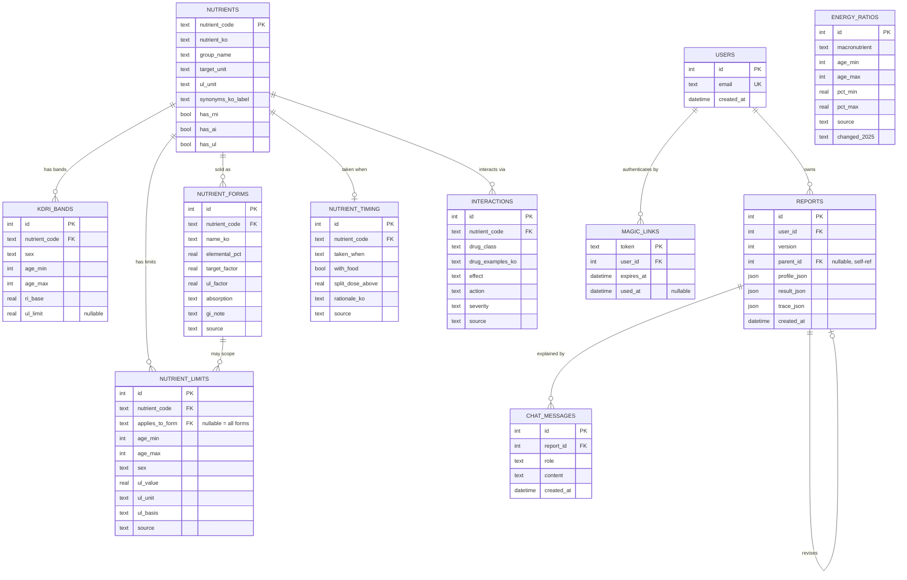
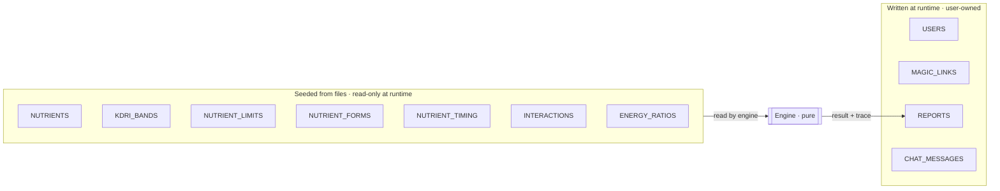
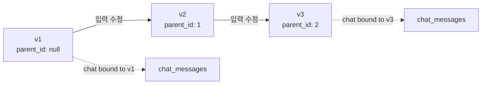

# ERD — 영양제 추천 엔진

> **This document is canonical for the database schema.** [PLAN.md §4](../PLAN.md#4-data-model-sqlite--postgres-path) and [design spec §11](superpowers/specs/2026-08-10-supplement-recommendation-design.md) carry summaries; when they disagree with this file, this file wins.

**Engine:** SQLite from Phase 2. Types kept Postgres-portable so a migration is a driver swap, not a rewrite.
**Phase 0-1 has no database.** Tables below are seeded from files; the engine takes them as in-memory dataclasses.

---

## 1. Full diagram



`ENERGY_RATIOS` has no relationships by design — see §4.

---

## 2. Two halves

The schema splits cleanly, and the split matters more than any individual table.



**Seeded half** is rebuilt from `data/vendor/` and `data/curated/` on every deploy. Nothing writes to it at runtime. A content change is a file change, reviewed as a git diff — see [권한정책.md](권한정책.md).

**Runtime half** holds user data only. It never contains nutrition knowledge, so a database restore from a bad deploy cannot corrupt a dose.

---

## 3. Seeded tables

### `nutrients`

| Column | Type | Notes |
|---|---|---|
| `nutrient_code` | TEXT PK | e.g. `magnesium`, `epa_dha` |
| `nutrient_ko` | TEXT | 마그네슘 |
| `group_name` | TEXT | `vitamin` · `mineral` · `macronutrient` |
| `target_unit` | TEXT | unit for RI/AI targets |
| `ul_unit` | TEXT | unit for upper limits |
| `synonyms_ko_label` | TEXT | pipe-delimited, powers parser matching |
| `has_rni` `has_ai` `has_ul` | BOOL | reference-type flags from vendor data |

**`target_unit` and `ul_unit` are separate columns for one reason: folate.** Its targets are `µg DFE`, its upper limit is `µg`, because the UL governs synthetic folic acid only. They are identical for the other 29 in-scope nutrients. A single unit column would silently mislabel a 1000 as DFE and overstate intake by 1.7×.

`has_rni` is not decorative — the [published-range validation](qa.md#dv-data-validation) selects which age bands to compare based on it.

### `kdri_bands`

| Column | Type | Notes |
|---|---|---|
| `nutrient_code` | TEXT FK | |
| `sex` | TEXT | `'M'` or `'F'` only |
| `age_min` `age_max` | INT | one of the 5 adult bands |
| `ri_base` | REAL NOT NULL | recommended intake, post-override |
| `ul_limit` | REAL NULL | **null for 12 of 30 nutrients** |

- **Exactly 300 rows** after filtering: 30 nutrients × 5 bands × 2 sexes. Rectangular, no gaps. This is what makes the UL property test exhaustive rather than sampled.
- Adult bands: `(19,29) (30,49) (50,64) (65,74) (75,99)`.
- **No `sex = 'ALL'` row exists for any adult band**, so sex has no fallback and cannot be defaulted.
- **`ul_limit` varies within a nutrient by band** — calcium is 2500 for F 19-29 and 2000 for F 30+. Never cache an upper limit per nutrient.
- Dropped at seed: all rows under 19, and pregnancy rows `(0,99)`.

> **Pregnancy rows are not consistently encoded.** Most are deltas (`iron +9`, `folate +220`, `magnesium +40`); `epa_dha` at 300 appears to be an absolute. They are dropped, not interpreted. Resolve per-nutrient before pregnancy is ever added.

### `nutrient_limits`

An upper limit is a property of **what is in the pill**, not only of the person taking it. Three of 30 nutrients prove it, so the general case is modelled rather than three special cases.

| Column | Type | Notes |
|---|---|---|
| `applies_to_form` | TEXT NULL | **null = all supplemental forms of this nutrient** |
| `ul_value` `ul_unit` | REAL / TEXT | |
| `ul_basis` | TEXT | `total_intake` or `supplemental_only` |
| `source` | TEXT NOT NULL | rejected at load if blank |

Seed rows:

| nutrient | form | value | basis | why |
|---|---|---|---|---|
| magnesium | *(all)* | 350 mg | supplemental_only | KDRI limit excludes food |
| niacin | 니코틴산 | 35 mg NE | supplemental_only | 2020 level retained |
| niacin | 니코틴아미드 | **850** mg NE | supplemental_only | lowered from 1,000 in 2025 |
| folate | *(all)* | 1000 **µg** | supplemental_only | governs synthetic folic acid |

`applies_to_form` is nullable because magnesium's and folate's limits are **not** per-form — they govern supplement-sourced intake generally. Forcing them onto `nutrient_forms` would require fabricating a row against every form.

### `nutrient_forms`

| Column | Type | Notes |
|---|---|---|
| `elemental_pct` | REAL | 산화마그네슘 `0.603`, 비스글리시네이트 `0.141` |
| `target_factor` | REAL DEFAULT 1.0 | folate 합성 엽산 = `1.7` |
| `ul_factor` | REAL DEFAULT 1.0 | folate 합성 엽산 = `1.0` |

**One pill produces two numbers.** A 400 µg folic acid tablet contributes 680 µg DFE toward the target and 400 µg toward the limit. Both factors default to 1.0, so this costs nothing for the 29 nutrients that don't need it.

### `interactions`

`severity` ∈ `low` · `medium` · `high` · `critical`. A drug class absent from this table returns 평가되지 않음 — the table is the whole authority, and the LLM never adds to it.

### `energy_ratios`

AMDR: 탄수화물 50-65%, 단백질 10-20%, 지방 15-30%.

**No foreign key, no relationship, and the engine never reads it.** An AMDR is a percentage of actual energy intake; diet logging is out of scope, so there is no denominator. It is displayed as reference in report block 4. A test asserts `energy_ratio` does not appear in `engine.py`.

---

## 4. Runtime tables

### `reports` — immutable versions



Nothing mutates. `입력 수정` prefills the wizard from `profile_json`, recomputes, and inserts a new row with `parent_id` pointing at the previous version.

| Column | Purpose |
|---|---|
| `profile_json` | full input snapshot — a report is reproducible from its own row, with no join to data that may since have changed |
| `result_json` | per-nutrient results |
| `trace_json` | every rule that fired, with citations |

`trace_json` is what makes a read-only why-chat viable: the exact derivation that produced an answer is stored beside it, so "why" is a lookup rather than a re-derivation.

### `chat_messages`

Bound to `report_id`, not `user_id` — a conversation belongs to one report *version*. `role` ∈ `user` · `assistant`.

---

## 5. Constraints and indexes

```sql
-- uniqueness
UNIQUE (nutrient_code, sex, age_min, age_max)          ON kdri_bands
UNIQUE (nutrient_code, name_ko)                        ON nutrient_forms
UNIQUE (user_id, version)                              ON reports
UNIQUE (email)                                         ON users

-- lookup paths the engine actually uses
INDEX  (nutrient_code, sex, age_min, age_max)          ON kdri_bands
INDEX  (nutrient_code, applies_to_form)                ON nutrient_limits
INDEX  (user_id, created_at DESC)                      ON reports
INDEX  (report_id, created_at)                         ON chat_messages

-- referential
FOREIGN KEY (parent_id)  REFERENCES reports(id)        ON DELETE SET NULL
FOREIGN KEY (user_id)    REFERENCES users(id)          ON DELETE CASCADE
FOREIGN KEY (report_id)  REFERENCES reports(id)        ON DELETE CASCADE

-- value domains
CHECK (sex IN ('M','F'))                               ON kdri_bands
CHECK (ul_basis IN ('total_intake','supplemental_only')) ON nutrient_limits
CHECK (severity IN ('low','medium','high','critical')) ON interactions
CHECK (role IN ('user','assistant'))                   ON chat_messages
CHECK (length(trim(source)) > 0)                       ON nutrient_limits, nutrient_forms, interactions
```

Deleting a user cascades to reports and chat messages. `parent_id` uses `SET NULL` so a deleted ancestor cannot orphan a chain.

SQLite requires `PRAGMA foreign_keys = ON` per connection — it is off by default and silently ignores the constraints above.

---

## 6. Seed-time assertions

Load fails and startup aborts if any of these are false. Bad data must never reach the engine.

| Assertion | Guards against |
|---|---|
| Exactly 300 band rows survive filtering | silent scope drift |
| Every surviving row has non-null `ri_base` and `sex ∈ {M,F}` | a nullable target reaching arithmetic |
| Zero rows with `age_min < 19` | pediatric dosing |
| Zero rows with `(age_min, age_max) = (0, 99)` | pregnancy deltas read as absolutes |
| Every nutrient has a `diet_baseline_pct` or an explicit `baseline_source: none` | a guessed baseline over-recommending |
| Every `nutrient_limits` row has non-null `ul_basis`, `ul_unit`, `source` | an uncited or unscoped limit |
| Every nutrient with `target_unit ≠ ul_unit` has factors on every form | the folate unit trap |
| Every curated row has a non-empty `source` | an uncited claim shipping |
| Every RI/AI range matches its published 2025 range, or is allowlisted with a reason | a stale edition surviving a re-import |
