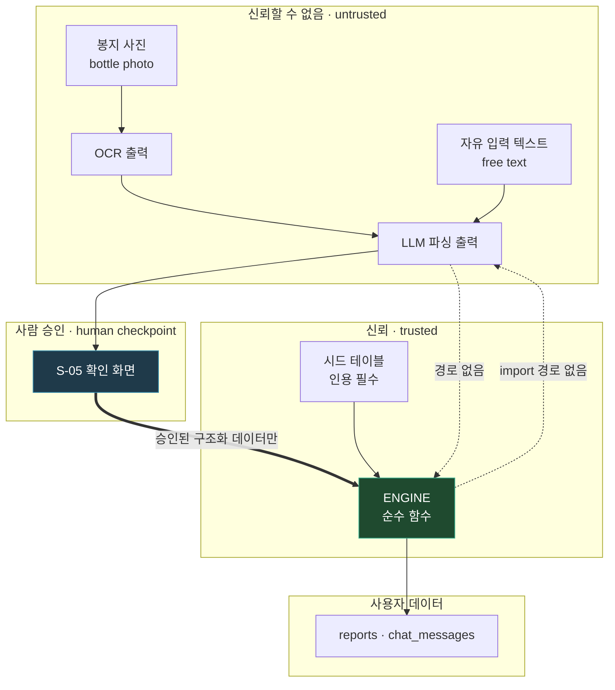

# 권한정책 — Access Control & Trust Boundaries

**Related:** [erd.md](erd.md) · [api.md](api.md) · [prd.md](prd.md) · [PLAN.md §4](../PLAN.md#4-data-model-sqlite--postgres-path)

---

## 1. What this system actually has

This platform has **one authenticated role**. Documenting a role hierarchy it does not have would be fiction, and fiction in a security document is worse than a short document.

| Actor | Authenticates? | What it can reach |
|---|---|---|
| **익명 방문자** (anonymous) | no | Landing page, intake wizard, a report it just created in-session |
| **사용자** (authenticated user) | magic link | Its own reports, its own chat messages. Nothing else |
| **영양 검토자** (nutrition reviewer) | **no account** | Curated content via git PR only. No runtime access, no login |
| **엔진** (engine) | n/a — system actor | Seeded tables, read-only. Cannot reach user data or the network |
| **LLM** | n/a — system actor | Four bounded call sites. Never reaches the database directly |

The interesting access control in this product is **not** between roles. It is between **system layers** — which is where §4 spends its length.

---

## 2. Permission matrix

| Resource | 익명 | 사용자 (owner) | 사용자 (non-owner) | 영양 검토자 |
|---|---|---|---|---|
| `nutrients`, `kdri_bands`, `nutrient_limits`, `nutrient_forms` | read | read | read | **write via PR** |
| `interactions`, `energy_ratios` | read | read | read | **write via PR** |
| `reports` — create | create (session-bound) | create | — | — |
| `reports` — read | own session only | read | **deny** | — |
| `reports` — update | **deny (immutable)** | **deny (immutable)** | deny | — |
| `reports` — delete | — | delete own | deny | — |
| `chat_messages` | session report only | own report only | **deny** | — |
| `users` | — | read/update own | deny | — |

**No role can update a report.** Immutability is enforced at the schema and API level, not by permission — there is no update endpoint to authorize. 입력 수정 inserts a new version.

### Anonymous → authenticated transition

A user can complete the wizard and receive a report without an account. That report is bound to a session cookie. On magic-link sign-in, session-bound reports are claimed by the new `user_id` in one transaction.

**This is the one place ownership changes hands**, so it gets its own test: a claimed report must never be claimable twice, and a session must never claim a report already owned by someone else.

---

## 3. Data classification

| Class | Fields | Handling |
|---|---|---|
| **Sensitive — health** | biomarker values, medication classes, supplement list | Scoped by `user_id`; never logged; never sent to an LLM outside the four call sites |
| **Sensitive — identity** | email | Scoped; used only for magic-link delivery |
| **Personal** | age, sex, optional weight | Stored in `profile_json` |
| **Derived** | `result_json`, `trace_json` | Same class as the inputs that produced them — a trace contains the health data |
| **Public** | nutrient tables, KDRI bands, AMDR | Read by anyone; no restriction |

**Never stored:** name, 주민등록번호, full medical records, or the raw checkup document after extraction. The photo of a supplement bottle is discarded after OCR; only the parsed rows persist.

**`trace_json` is health data.** It is derived, but it embeds the user's intake and biomarker values. It receives the same protection as `profile_json` — worth stating because "it's just a log" is exactly how derived data leaks.

---

## 4. Trust boundaries

These are the boundaries that actually enforce safety. Each has a test.

### TB-1 — Engine ↮ LLM (module boundary)

**Rule:** `src/kdri/engine.py` and `src/kdri/lookup.py` have no import path to `src/kdri/llm/`.

**Why:** if the engine could reach a model API, a model could become the origin of a dose. The boundary is structural rather than procedural, because a rule that depends on remembering it will eventually be forgotten.

**Enforced by:** a test that reads the engine source and asserts the absence of any `llm` import, plus the existing assertion that `energy_ratio` never appears in `engine.py`.

### TB-2 — Confirm screen (human checkpoint)

**Rule:** no API path exists from OCR output or parser output directly to `POST /api/reports`.

**Why:** OCR misreads curved labels and parsers mis-map synonyms. Either error becomes a wrong dose with no way for the user to notice. A human approving a structured table is cheap; a wrong magnesium recommendation is not.

**Enforced by:** the parse and OCR endpoints return a payload the client must submit through the report endpoint; `POST /api/reports` accepts only structured intake and has no free-text field.

### TB-3 — `user_id` accessor (data isolation)

**Rule:** every read of `reports` and `chat_messages` goes through one accessor keyed on the authenticated `user_id`. No ad-hoc queries against those tables anywhere in the codebase.

**Why:** health data. A missing `WHERE user_id = ?` is a cross-user leak of someone's medication list.

**Enforced by:** a single module owns those queries; a test greps the codebase for direct `SELECT ... FROM reports` outside it.

> **Stated limit, plainly:** this is application-layer enforcement. A bug in the accessor is a leak — the database will not stop it. Postgres row-level security is the upgrade path, and it is the main reason [erd.md](erd.md) keeps the schema portable. On SQLite there is no RLS to fall back on.

### TB-4 — Curated content (git PR gate)

**Rule:** nutrition knowledge changes only through a reviewed pull request. There is no admin UI and no runtime write path to the seeded tables.

**Why:** every dose ultimately derives from these files. A web form with an audit log is weaker than a diff with an author, a reviewer, and a permanent history — and CI can reject an uncited row in a way a form cannot.

**CI rejects:** a blank `source`, a `PROVISIONAL` baseline, an `elemental_pct` outside `(0, 1]`, a missing profile for an in-scope nutrient, a generic placeholder source, an unknown `ul_basis` or `severity`.

### TB-5 — Chat read-only

**Rule:** the chat endpoint reads `trace_json` and writes only `chat_messages`. It cannot write `reports`.

**Why:** if a conversation could mint a recommendation, every safety property above would be reachable around rather than through.

**Enforced by:** the chat handler receives a read-only report projection; a test asserts no write to `reports` occurs during a chat turn.

---

## 5. Authentication

| Property | Choice |
|---|---|
| Method | Email magic link. No passwords stored, ever |
| Token | Single-use, 15-minute expiry, invalidated on use (`used_at`) |
| Session | HTTP-only, `Secure`, `SameSite=Lax` cookie |
| Rate limit | 5 link requests per email per hour; 20 per IP per hour |
| Enumeration | Identical response whether or not the email exists |
| Session lifetime | 30 days sliding; re-auth required to change email |

No password reset flow exists, because no passwords exist. That removes the single most commonly exploited account-recovery surface.

---

## 6. Audit

| Event | Logged | Contains health data? |
|---|---|---|
| Magic link requested / consumed | yes | no |
| Report created (id, user_id, version) | yes | **no** — never the contents |
| Report deleted | yes | no |
| Session report claimed at sign-in | yes | no |
| Seed run: assertion pass/fail | yes | no |
| Curated content change | **git history** | no |

**Report contents are never written to application logs.** Debugging a bad recommendation is done by replaying `profile_json` through the engine locally, not by reading logs — which is possible precisely because the engine is pure and reports are self-contained.

---

## 7. Not implemented — deliberate

| Gap | Status |
|---|---|
| Admin role or admin UI | Decided against. Content moves through git; there is no operational surface to administer |
| Support access to a user's report | **Open.** Nobody can currently view another user's report, including the operator. The first "my report is wrong" email will force this decision — it needs a defined trigger, time-box, and audit entry before it is improvised |
| Database-enforced row-level security | Requires Postgres. Documented as the upgrade path in TB-3 |
| Field-level encryption of biomarker columns | Not in MVP. Protects against a database dump; costs key management and makes those fields unqueryable |
| Multi-tenancy | Not applicable. There are no organizations, only individuals |
| Data export / deletion request flow | Delete-own-report exists. A full 개인정보 export flow is a pre-launch item under Korean 개인정보보호법 |

The support-access gap and the export flow are the two that will bite first. Both are listed in [PLAN.md §8](../PLAN.md#8-open-questions).
