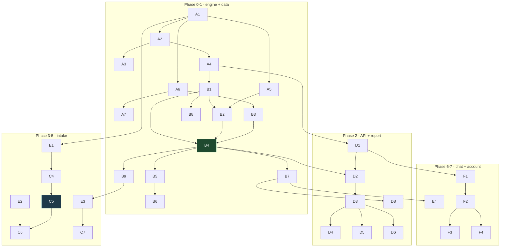

# 기능명세서 — Feature Specification

**Related:** [prd.md](prd.md) · [화면흐름도.md](화면흐름도.md) · [api.md](api.md) · [qa.md](qa.md)

Features are ordered so that work can run in parallel where it is genuinely independent and strictly sequential where it is not. `FR-xx` IDs map to [prd.md §5](prd.md#5-functional-requirements); `TC-xx` cases live in [qa.md](qa.md).

---

## 1. Priority scheme

| Level | Meaning |
|---|---|
| **P0** | The product is wrong or unsafe without it. Blocks release of its phase |
| **P1** | The product works but is materially worse. Ships in its phase unless the phase is at risk |
| **P2** | Improvement. Can slip a phase without harm |

Priority is **not** sequence. A P0 in Phase 6 is still built after a P1 in Phase 2.

---

## 2. Feature index

### Area A — Data & validation (Phase 0-1)

| ID | Feature | Pri | FR | Depends on |
|---|---|---|---|---|
| A1 | Vendor CSV loading into frozen dataclasses | P0 | — | — |
| A2 | Cited value overrides (`overrides.csv`) | P0 | FR-24 | A1 |
| A3 | Published 2025 range validation | P0 | FR-24 | A2 |
| A4 | Scope filter + rectangularity assertions | P0 | FR-23 | A2 |
| A5 | Form-scoped limit table loading | P0 | FR-9 | A1 |
| A6 | Nutrient profiles (baselines, forms, factors) | P0 | FR-10, FR-11 | A1 |
| A7 | 30 cited KNHANES diet baselines | P0 | FR-11 | A6 |
| A8 | Drug interaction table | P1 | FR-18 | A1 |
| A9 | AMDR reference data | P2 | FR-17 | A1 |

### Area B — Engine (Phase 0)

| ID | Feature | Pri | FR | Depends on |
|---|---|---|---|---|
| B1 | Band lookup (sex + age exact match) | P0 | FR-7 | A4 |
| B2 | Four-step limit resolution | P0 | FR-9 | A5, B1 |
| B3 | Dual-unit intake accounting | P0 | FR-10 | A6 |
| B4 | Gap / headroom / recommend computation | P0 | FR-8, FR-11 | B1, B2, B3 |
| B5 | Status classification | P0 | FR-12 | B4 |
| B6 | Priority ordering | P1 | FR-13 | B5 |
| B7 | Trace emission | P0 | FR-14 | B4 |
| B8 | Out-of-scope refusal | P0 | FR-23 | B1 |
| B9 | Sensitivity analysis (gap detection) | P1 | FR-15 | B4 |

### Area C — Intake (Phase 2-5)

| ID | Feature | Pri | FR | Depends on |
|---|---|---|---|---|
| C1 | Profile form (age, sex required) | P0 | FR-1 | D1 |
| C2 | Medication class selector | P1 | FR-5 | C1 |
| C3 | Biomarker entry | P2 | FR-6 | C1 |
| C4 | Free-text supplement parsing | P0 | FR-2 | E1 |
| C5 | **Confirm screen** | P0 | FR-4 | C4 |
| C6 | Photo upload + OCR | P1 | FR-3 | C5, E2 |
| C7 | Follow-up question UI | P1 | FR-15 | B9, E3 |

### Area D — API & report (Phase 2)

| ID | Feature | Pri | FR | Depends on |
|---|---|---|---|---|
| D1 | SQLite persistence + seeding | P0 | — | A4 |
| D2 | `POST /api/reports` | P0 | FR-7…FR-14 | B4, D1 |
| D3 | `GET /api/reports/{id}` | P0 | FR-16 | D2 |
| D4 | Report block ① 입력 요약 | P0 | FR-16 | D3 |
| D5 | Report block ② 현재 상태 분석 | P0 | FR-16 | D3, B6 |
| D6 | Report block ③ 추천 | P0 | FR-16 | D3 |
| D7 | Report block ④ AMDR 참고 | P2 | FR-17 | A9 |
| D8 | Trace expansion UI | P1 | FR-14 | B7, D3 |
| D9 | Interaction flag rendering | P1 | FR-18 | A8, D6 |

### Area E — LLM boundary (Phase 3-6)

| ID | Feature | Pri | FR | Depends on |
|---|---|---|---|---|
| E1 | Claude parse: text → structured intake | P0 | FR-2 | A1 |
| E2 | CLOVA OCR: photo → text | P1 | FR-3 | — |
| E3 | Question phrasing from ranked gaps | P1 | FR-15 | B9 |
| E4 | Trace-grounded why-chat | P0 | FR-19 | B7, D3 |

### Area F — Account & history (Phase 7)

| ID | Feature | Pri | FR | Depends on |
|---|---|---|---|---|
| F1 | Magic link issue + verify | P0 | FR-22 | D1 |
| F2 | Report versioning (`parent_id`) | P0 | FR-20 | D2, F1 |
| F3 | 입력 수정 → recompute | P0 | FR-20 | F2 |
| F4 | History list with revision chains | P1 | FR-21 | F2 |

---

## 3. Dependency graph



---

## 4. Parallel work tracks

Three tracks can run concurrently once **A4 (scope filter)** lands. Before that, everything is sequential — the engine cannot be written against unvalidated data.

```mermaid
gantt
    dateFormat X
    axisFormat %s
    title Work tracks after A4

    section Track 1 · Engine
    B1 B2 B3 B4 B5 B7      :t1, 0, 4
    B6 B8 B9               :after t1, 2

    section Track 2 · Content
    A6 A7 (30 baselines)   :t2, 0, 5
    A8 interactions        :after t2, 2

    section Track 3 · Frontend
    C1 wizard shell        :t3, 0, 3
    D4 D5 D6 report blocks :after t3, 3
```



**Track 1 (engine)** and **Track 2 (content authoring)** are genuinely independent: the engine is tested against test-local profiles, not shipped curated values, precisely so a nutrition reviewer sourcing KNHANES figures never blocks an engineer.

**Track 3 (frontend)** can build against a fixture report JSON before `D2` exists. The report shape is fixed by [api.md](api.md).

**What cannot parallelize:** `C4 → C5 → C6`. The confirm screen must exist before OCR, because OCR without a human checkpoint is a path from a misread label straight into a dose calculation.

---

## 5. Feature specifications

Only features whose behavior is not obvious from the ID are specified here. Acceptance criteria are testable statements; QA cases derive from them.

### A3 — Published 2025 range validation · P0

Compare each nutrient's RI/AI range against the 2025 published range from 붙임3.

**Selection rule** — the published range covers each nutrient's *own reference type*:

- `has_rni = true` → compare RNI bands only; exclude infant month bands `(0,5)` and `(6,11)`
- `has_rni = false` → AI nutrient; include every band
- Exclude pregnancy `(0,99)` in both cases

**Acceptance**
- Runs on the full 1052 rows **before** scope filtering
- 28/30 match as shipped; magnesium passes after its override; `epa_dha` is allowlisted with a stated reason
- Removing the magnesium override makes the check fail and name magnesium

> Filtering to adults before checking would hide the magnesium 15-18 defect. A check that only sees what you already trust is worth nothing.

### A7 — Cited KNHANES diet baselines · P0

One `diet_baseline_pct` per in-scope nutrient, each traceable to a named KNHANES table and year.

**Acceptance**
- All 30 nutrients have a baseline or an explicit `diet_baseline_source: none`
- Zero sources containing `PROVISIONAL`
- `0.0 ≤ diet_baseline_pct ≤ 1.5`
- A nutrient with `baseline_source: none` yields `UNKNOWN` and **no number**

> Guessing a baseline is not a neutral default. Assuming zero from food recommends a full RI on top of diet, which is an overdose path on tight-UL nutrients.

### B2 — Four-step limit resolution · P0

An upper limit is a property of what is in the pill.

1. `nutrient_limits` row matching a **declared form** → 니코틴아미드 = 850 mg NE
2. `nutrient_limits` row with `applies_to_form` null → magnesium = 350 mg, folate = 1000 µg
3. `kdri_bands.ul_limit`, always `total_intake` basis
4. No limit — `recommend` capped by `gap` alone

**Acceptance**
- 니코틴아미드 500 mg resolves to 850, status `ADEQUATE`
- 니코틴산 500 mg resolves to 35, status `OVER`
- Magnesium with no declared form resolves to 350 `supplemental_only`
- Zinc resolves to the band's 35 `total_intake`
- Biotin resolves to `None`; recommend still ≤ gap

### B3 — Dual-unit intake accounting · P0

```
toward_target = Σ(dose × elemental_pct × target_factor × doses_per_day)
toward_limit  = Σ(dose × elemental_pct × ul_factor     × doses_per_day)
```

**Acceptance**
- 400 mg 비스글리시네이트 → 56.4 toward both
- 200 µg 엽산 → **340** toward target, **200** toward limit
- Unknown or absent form → factors default to 1.0, dose treated as elemental
- `doses_per_day` multiplies both

### B4 — Computation · P0

```
gap      = max(0, target − diet − toward_target)
headroom = None                              if no limit
         = limit − toward_limit              if supplemental_only
         = limit − diet − toward_limit       if total_intake
recommend = round_down(max(0, min(gap, headroom)), 2 sig figs)
```

**Acceptance**
- `round_down(57.6) == 57.0`; never rounds toward a limit
- `supplemental_only` excludes diet — magnesium M 30-49 has RI 380 **above** its 350 supplemental limit, and computing `350 − diet − current` reports a healthy adult as over-supplemented before they take anything
- No limit ⇒ `recommend == round_down(gap)`, never unbounded

### B8 — Out-of-scope refusal · P0

**Acceptance**
- `age < 19` raises before any computation, with a message naming the reason
- Pregnancy or lactation declared → refusal, no numbers, 산부인과 referral
- No band row → `UNKNOWN`, target and current shown, no recommendation
- Every refusal names its cause; none returns a silent zero

### B9 — Sensitivity analysis · P1

Re-run the engine with each missing field pinned to its plausible min and max; rank fields by the largest swing in any `recommend`; surface the top 3.

**Acceptance**
- Never surfaces a field whose min/max pinning changes no recommendation
- Caps at 3 questions
- Deterministic — same profile yields the same ranked list
- Completes within the NFR-5 budget (~360 passes, pure arithmetic)

### C5 — Confirm screen · P0 · **trust boundary**

**Acceptance**
- Both OCR and manual paths render into this one screen
- Every row is editable: nutrient, form, dose, unit, doses/day
- Items the parser could not map are shown as **확인 필요**, never dropped
- Ambiguous label readings prompt explicitly — "마그네슘 400mg" as elemental vs compound changes the answer by ~2.5×
- No API path exists from parse or OCR directly to `POST /api/reports`

### D5 — Report block ② 현재 상태 분석 · P0

Per nutrient: target, from diet, from supplements, gap, status.

**Acceptance**
- Order: `OVER` → biomarker-flagged → `DEFICIT` by gap ratio → `ADEQUATE` → `UNKNOWN`
- `OVER` renders as a reduction instruction, not a dose
- `UNKNOWN` shows target and current with no recommendation and a stated reason
- Every displayed number expands to its trace step

### E4 — Trace-grounded why-chat · P0

**Acceptance**
- Context is `trace_json` for one report version and nothing else
- Refuses to produce a dose not present in the trace
- When the user reveals a missing input, points to 입력 수정 rather than recomputing
- Chat never writes to `reports`

---

## 6. Cross-cutting rules

These bind every feature and are not restated per item.

| Rule | Enforcement |
|---|---|
| The LLM never produces a number | `engine.py` has no import path to `llm/`; asserted by test |
| Every curated value is cited | Load raises on a blank `source`; CI rejects `PROVISIONAL` |
| Vendor files are never hand-edited | Corrections go to `overrides.csv` with a source |
| Reports are immutable | 입력 수정 inserts a new version; nothing updates |
| Health data reads scope by `user_id` | Single accessor — see [권한정책.md](권한정책.md) |
| Every refusal states its reason | No silent zeros, no empty states without cause |
| All user-facing copy in Korean | — |
