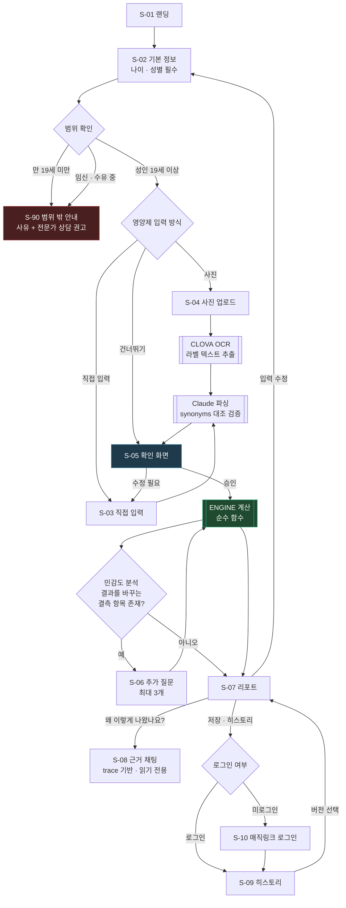
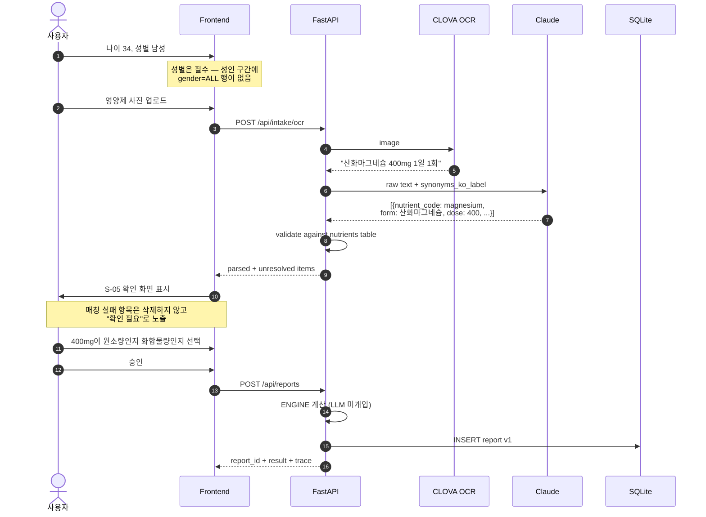
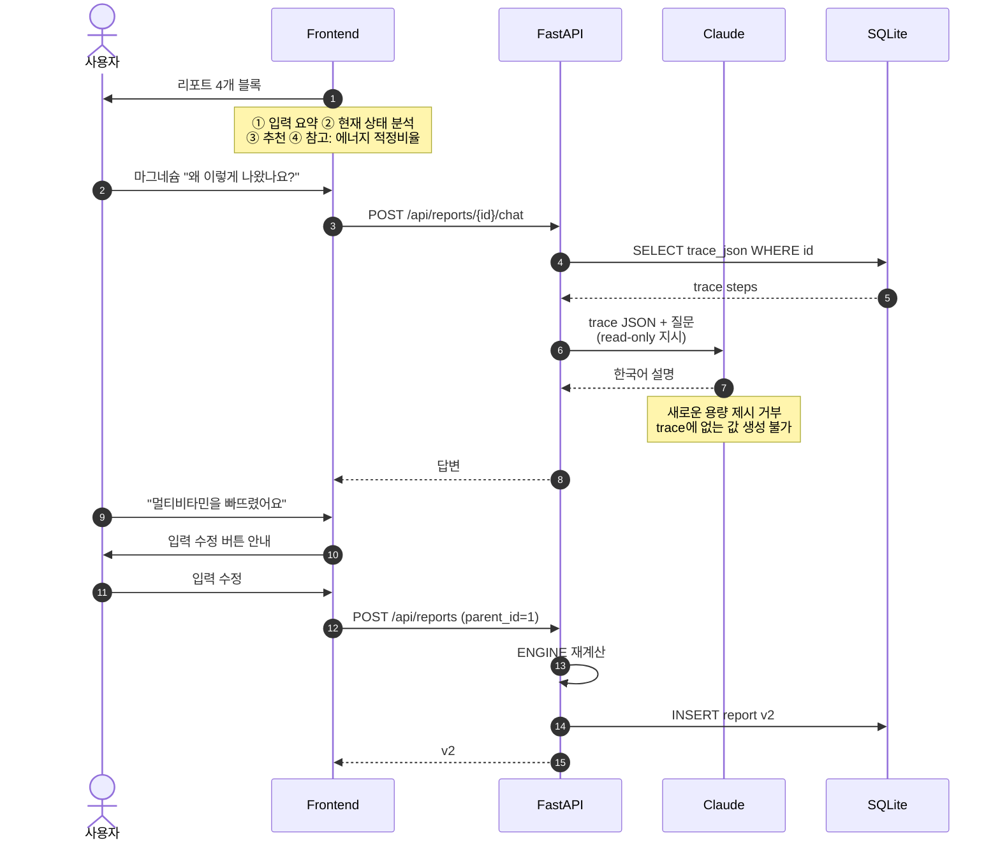
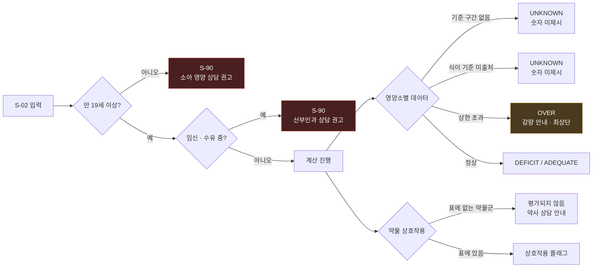
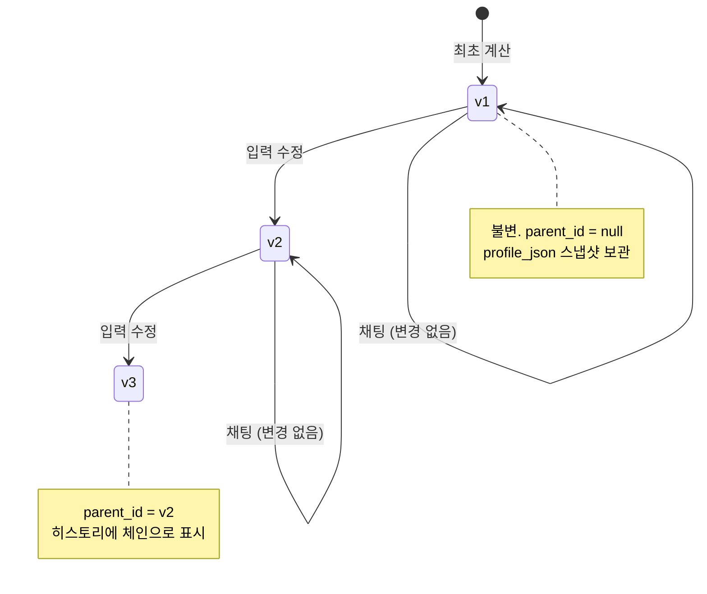

# 화면흐름도 — Screen Flow & User Journey

**Related:** [prd.md](prd.md) · [기능명세서.md](기능명세서.md) · [와이어프레임.md](와이어프레임.md) · [api.md](api.md)

All screens are Korean. Screen IDs (`S-xx`) are referenced by [와이어프레임.md](와이어프레임.md) and [qa.md](qa.md).

---

## 1. Screen inventory

| ID | Screen | Route | Phase |
|---|---|---|---|
| **S-01** | 랜딩 | `/` | 2 |
| **S-02** | 기본 정보 입력 | `/intake` | 2 |
| **S-03** | 복용 중인 영양제 입력 | `/intake/supplements` | 3 |
| **S-04** | 사진 업로드 | `/intake/photo` | 4 |
| **S-05** | 확인 화면 (trust boundary) | `/intake/confirm` | 3 |
| **S-06** | 추가 질문 | `/intake/questions` | 5 |
| **S-07** | 리포트 | `/reports/[id]` | 2 |
| **S-08** | 근거 채팅 | `/reports/[id]/chat` | 6 |
| **S-09** | 히스토리 | `/history` | 7 |
| **S-10** | 로그인 (매직링크) | `/login` | 7 |
| **S-90** | 범위 밖 안내 (refusal) | `/out-of-scope` | 2 |

---

## 2. Master flow

**Two nodes carry the design's weight.**

`S-05 확인 화면` is the **trust boundary**. Both input paths converge on it, and nothing unstructured reaches the engine without a human approving it. There is no route from OCR or parsing directly into computation.

`ENGINE` is a pure function. Every arrow into it carries approved structured data; every arrow out carries a result and a trace. The LLM appears on this diagram four times and never inside that box.

---

## 3. Intake journey (S-02 → S-05)

Steps 6-8 are the only place unstructured text becomes structured data, and step 12 is the only path from there into the engine.

---

## 4. Report and explanation (S-07 → S-08)

The chat cannot change a recommendation. When the user reveals a missing input, the correct path is 입력 수정 → recompute → v2. Steps 13-17 exist so that the read-only constraint is a workflow, not a dead end.

---

## 5. Refusal paths (S-90)

Every refusal states its reason. The system declines rather than guesses — a guessed diet baseline systematically over-recommends, and a guessed pregnancy adjustment is worse.

---

## 6. Report versioning (S-07 ↔ S-09)

Chat never transitions state. Only 입력 수정 creates a version, and it inserts rather than updates — so any past answer remains explainable by the trace stored beside it.

---

## 7. Progressive disclosure by phase

The flow above is the Phase 7 end state. Earlier phases short-circuit it:

| Phase | Reachable | Missing |
|---|---|---|
| **2** | S-02 → S-05 (manual only) → S-07 | no OCR, no follow-ups, no chat, no accounts |
| **3** | + S-03 free-text parse | no OCR |
| **4** | + S-04 photo | — |
| **5** | + S-06 follow-ups | — |
| **6** | + S-08 chat | no history |
| **7** | + S-09, S-10 | — |

Phase 2 is a complete user journey with a hand-typed intake. Everything after it removes friction rather than adding capability.
